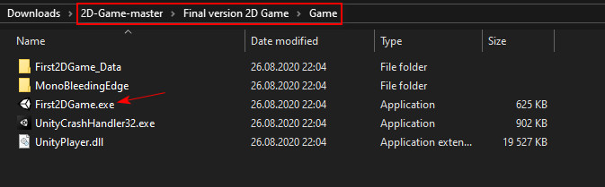

# You can try the game by downloading the ZIP file, unpacking it and chosing the file in following directory:
Use your arrows to controle the Hero.

 

(Sorry, it will take some time and about 190mb hard-drive space).

# 2D Game ("The 10th Planet")
 
 Second project of Game Dev class
 

About the Game
Description of the game. 

•	Rules of the game

Experience brave astronaut trying to escape enemy ship which in a deep space, in this endless running game!
Test your reflexes trying to dodge the bullets launched by evil enemy and jumping over obstacles and lasers which could literally kill you! Collect life-giving fuel cans to increase your score. See how far you can run to meet your freedom. Good luck to you in this long journey!

•	Controls
As you run out of never-ending corridor you can use your keyboard to control the character.
Press Left and Right arrows to run further and avoid bullets
Press Up arrow to jump and collect Fuel-cans and avoid lasers.
Press Esc button to Pause the Game.

•	Score
Collect as much fuel-cans and secret keys as you can to increase your score. Fuel-Can gives 1 point and secret key – 5.
       Train your skill to see how far you can run with this amazing game using distance counter. 
       Compete your results with your friends!

You will have three lives to try to escape, you are able to replenish your health bar by collecting Fuel-cans located through the stage. When all three lives are gone the game ends for you to start all over again. As we said, this game never ends, just like your excitement!

Designing the Game
### Screenshots the animation states of the hero

### Hero’s State machine diagram screenshot.
 

### Colliders in the Game
1)	Hero.
  Has collider to interact with different objects of the game:
a)	With Ground and Crate to run and jump. 
b)	With lasers and bullets to receive damage. 
c)	With Fuel can to receive health and points. 
d)	With Secret key activation trigger to activate the Secret Key. 
e)	With Key itself to receive extra points and remove laser wall. 
f)	With move prefab triggers to create endless level.

2)	Back Wall collider – Collider which prevent hero from falling of the current Prefab. And it also prevents bullet from the Gun to enter current scene.
3)	Front Wall collider – Prevent bullet from ahead Prefabs enter the scene.  

4)	Move prefab trigger - to Collide only with Hero and move Prefab to create endless level.
5)	Ground – to hero to move on and check if is on ground.
6)	Crate - to collide with hero and create additional obstacle. 
7)	FuelCan – to collide with Hero and restore health.
8)	Lasers and Laser Wall - to collide with Hero and decrease health.
9)	Secret key – to collide with Hero and restore health and deactivate Laser wall. 
10)	Secret key activation trigger - to collide with Hero and activate Secret Key appearance. 
 
 

### Most Challenging aspects were:
1)	Animation states of the Hero. 
Transitions between states, which weren’t covered in PowerPoint lectures were challenging part. Creating own scheme of transitions helped. For example, the “hurt animation” when hero jumped and was in the middle of the air was not running.  The solution was easy: ticking the “has exit time” but to figure it out took much time. Also, was issue with stopping hero form moving after dead. Was solved by putting code dirX = 0; when life = 0 that stop Hero from moving after dead. 

2)	Tracking Gun was another complicated part. 
Was needed create Firing Gun script which calculate changing gun’s angle depending on Hero position. Solution was:

public Transform player; // reference to Hero’s Transform

Vector3 direction = player.position - transform.position; // to update player position each frame

float angle = Mathf.Atan2(direction.y, direction.x) * Mathf.Rad2Deg;  //to calculate angle using Mathf.Atan2 and Mathf.Rad2Deg to transforms radians to angle.

rb.rotation = angle; // set the angle which gun should rotate on each frame.

The feature was successfully implemented in the Game.
